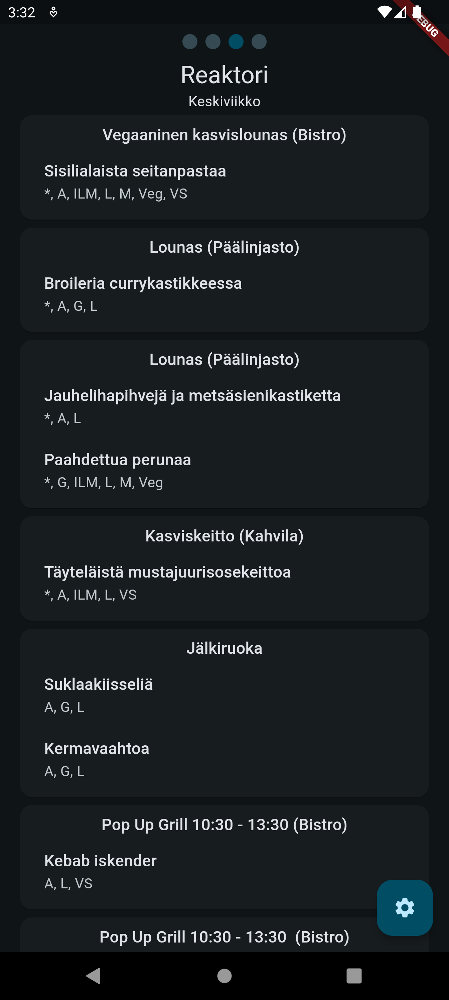

# Flutter Lunch Menu App

[](https://github.com/sruusk/flutter-menu/actions/workflows/release.yml)

This project displays the menus of student restaurants. It uses the backend API from [sruusk/ou-lunch](https://github.com/sruusk/ou-lunch) for the menu data.

## Features

- Fetches menu data from the backend API.
- Displays menus for different campuses.
- Supports multiple languages for menu items.
- Allows users to switch between campuses.
- Supports dark/light themes.
- Allows selecting a date to view the menu for that day.

## Screenshot



## Getting Started

### Prerequisites

- Flutter SDK
- Dart SDK

### Installation

1. Clone the repository:
    ```sh
    git clone https://github.com/sruusk/flutter-menu.git
    ```
2. Navigate to the project directory:
    ```sh
    cd flutter-menu
    ```
3. Install dependencies:
    ```sh
    flutter pub get
    ```

### Running the App

To run the app on an emulator or physical device, use:
```sh
flutter run
